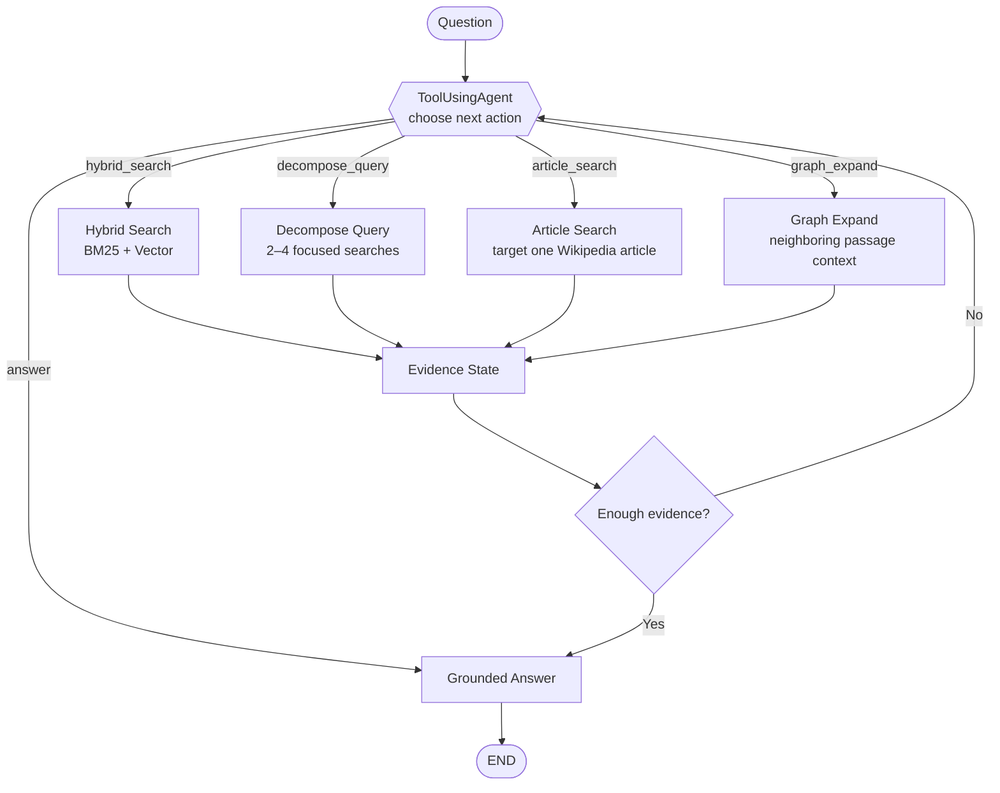

# Capstone Checkpoint 5.1 --- Agent-Based RAG for the Wikipedia Retrieval Engine

This checkpoint extends the Wikipedia Retrieval Engine from **advanced
retrieval** into an **agent-based RAG workflow**. The implementation compares 
three levels of retrieval autonomy:

1.  **Fixed retrieval** --- one hybrid retrieval pass followed by
    grounded answer generation.
2.  **Agentic retrieval** --- retrieve, inspect the evidence, decide
    whether more information is needed, refine the query, and retrieve
    again.
3.  **Tool-using agent** --- reason about the current evidence, choose
    among multiple retrieval tools, execute the selected tool, inspect
    the accumulated evidence, and either continue or answer.

The goal is not simply to perform more searches. The goal is to evaluate
whether giving the system control over **when to retrieve, what to
retrieve, and which retrieval action to use** improves evidence coverage
for multi-part, comparative, and multi-hop Wikipedia questions.

This checkpoint builds directly on the hybrid and advanced retrieval
work from earlier modules while applying the agentic workflow concepts
from **Lab 5.1** and **Lab 5.2**.

------------------------------------------------------------------------

## Agent-Based Retrieval Architecture

The checkpoint compares three architectures over the same Wikipedia
corpus and hybrid retrieval foundation.

``` text
FIXED RETRIEVAL

Question
   ↓
Hybrid Search
(BM25 + Vector)
   ↓
Top-k Passages
   ↓
Grounded Answer
```

``` text
AGENTIC RETRIEVAL

Question
   ↓
Hybrid Search
   ↓
Inspect Evidence
   ↓
Enough evidence?
   ├── YES → Grounded Answer
   │
   └── NO  → Generate / refine retrieval query
                 ↓
             Hybrid Search
                 ↓
             Inspect Evidence
                 ↺
```



*Figure: Progressive retrieval autonomy in Capstone Checkpoint 5.1. The
fixed pipeline always performs one search, the agentic retriever decides
whether to search again, and the tool-using agent chooses which
retrieval action to execute.*

The important architectural change is that **hybrid retrieval is no
longer the entire pipeline**. In the tool-using workflow, it becomes one
capability available to the agent.

------------------------------------------------------------------------

## Folder layout

A typical working folder for this checkpoint contains:

``` text
Checkpoint_5_1/
├── Capstone_Checkpoint_5_1_Final.py
├── Wikipedia_10_text/
│   ├── 85th_Academy_Awards.txt
│   ├── Adolf_Hitler.txt
│   ├── Bird.txt
│   ├── Emirates_(airline).txt
│   ├── Empire_State_Building.txt
│   ├── Hallstatt.txt
│   ├── Margaret_Thatcher.txt
│   ├── Mytilidae.txt
│   ├── Queen_Victoria.txt
│   └── Steve_Jobs.txt
├── wikipedia_5_1_chroma_hf/
│   └── checkpoint_5_1_wiki10.json
└── Tool_using_agent_1.log
└── README_Capstone_5_1.md
└── Readme_5_1.png
└── Output_agent_5.1.txt

```

The Python file expects the converted Wikipedia text corpus and uses a
persistent Chroma vector database. Important paths can be overridden
with environment variables.

------------------------------------------------------------------------

## Setup

Create or activate the Python environment and install the required
packages:

``` bash
pip install chromadb sentence-transformers rank-bm25 langchain-openai langchain-core
```

The checkpoint uses **LM Studio** through its OpenAI-compatible local
API.

Start LM Studio, load the configured model, and make sure the local
server is available at:

``` text
http://127.0.0.1:1234/v1
```

The current configuration uses:

``` text
LLM model:       meta-llama-3.1-8b-instruct
Embedding model: sentence-transformers/all-MiniLM-L6-v2
Vector store:    Chroma
Lexical search:  BM25
```

Then run the script:

``` bash
python Capstone_Checkpoint_5_1_Final.py
```

If the filename still contains parentheses, quote it in PowerShell:

``` powershell
python "Capstone_Checkpoint_5_1_Final.py"
```

------------------------------------------------------------------------

## Main configuration

The important retrieval and agent settings are defined near the top of
the script.

  ------------------------------------------------------------------------------------------
  Setting                 Default                                    Purpose
  ----------------------- ------------------------------------------ -----------------------
  `LM_STUDIO_BASE_URL`    `http://127.0.0.1:1234/v1`                 Local OpenAI-compatible
                                                                     LM Studio endpoint

  `LLM_MODEL`             `meta-llama-3.1-8b-instruct`               Planning, decision,
                                                                     decomposition, and
                                                                     answering model

  `WIKIPEDIA_TEXT_DIR`    `Wikipedia_10_text`                        Wikipedia TXT corpus

  `LOG_PATH`              `hybrid_agent_1.log`                       Evaluation output log

  `TEMPERATURE`           `0.0`                                      Deterministic LLM
                                                                     behavior

  `MAX_STEPS`             `3`                                        Maximum retrieval/tool
                                                                     decisions

  `CHROMA_DIR`            `wikipedia_5_1_chroma_hf`                  Persistent Chroma
                                                                     database

  `EMBEDDING_MODEL`       `sentence-transformers/all-MiniLM-L6-v2`   Passage embeddings

  `COLLECTION_NAME`       `wikipedia_checkpoint_5_1_passages`        Chroma collection

  `CANDIDATE_POOL`        `12`                                       Candidate set before
                                                                     final hybrid ranking

  `WEIGHT_BM25`           `0.5`                                      BM25 contribution

  `WEIGHT_VECTOR`         `0.5`                                      Vector contribution
  ------------------------------------------------------------------------------------------

The three evaluated systems deliberately share the same corpus, chunking
strategy, hybrid retriever, embeddings, and grounded answer prompt. This
makes the comparison focus on **control strategy**, rather than changing
the underlying knowledge source.

------------------------------------------------------------------------

## What a run produces

A complete run is designed to:

1.  load the Wikipedia TXT corpus;
2.  divide articles into overlapping passages;
3.  load or build the Chroma vector database;
4.  initialize the BM25 + vector hybrid retriever;
5.  verify that LM Studio and the selected model are available;
6.  run the checkpoint test questions;
7.  execute the **FIXED** pipeline;
8.  execute the **AGENTIC** retrieval pipeline;
9.  execute the **TOOL_USING_AGENT** pipeline;
10. print retrieval decisions, actions, stopping reasons, passage
    counts, and elapsed time; and
11. write structured results to the log file.

Typical output has this structure:

``` text
========================================================================
Test 1: ...

FIXED answer:
...

FIXED stop=single_pass
Queries: [...]
Passages retrieved: 4

[agentic] retrieving for: ...
[agentic] done=...
...

AGENTIC answer:
...

AGENTIC stop=...
Queries: [...]
Passages retrieved: ...

[tool-agent] STEP 1/3
[tool-agent] selected: article_search
...

[tool-agent] STEP 2/3
[tool-agent] selected: graph_expand
...

[tool-agent] STEP 3/3
[tool-agent] selected: hybrid_search
...

TOOL_USING_AGENT answer:
...

TOOL_USING_AGENT stop=step_limit

Tool actions:
  {...}
  {...}
  {...}

Passages retrieved: ...
```

This makes the agent's behavior inspectable instead of reporting only
the final answer.

------------------------------------------------------------------------

## Core concepts in this checkpoint

-   **Fixed RAG baseline** --- a single hybrid retrieval pass provides
    the comparison point for the more autonomous workflows.

-   **Agentic retrieval** --- retrieval becomes an iterative decision.
    The system can inspect what it found, identify missing evidence,
    formulate follow-up queries, and search again.

-   **Tool-using agent** --- the agent is given a menu of actions rather
    than only the choice to continue or stop. It selects the retrieval
    operation that appears most appropriate for the current evidence
    state.

-   **Planning as routing** --- the LLM returns structured JSON
    describing the next action. Ordinary Python code executes that
    action. The model chooses; the program performs the tool operation.

-   **Evidence state** --- retrieved passages accumulate across tool
    calls. Each new decision is made with awareness of evidence
    collected so far and previous actions.

-   **Hybrid retrieval as a tool** --- BM25 + vector search remains
    important, but it is now one tool within a larger agent workflow.

-   **Query decomposition** --- complex or multi-part questions can be
    split into focused information needs before searching.

-   **Targeted article search** --- when the relevant Wikipedia article
    is known, the agent can restrict retrieval to passages from that
    article.

-   **Local graph expansion** --- retrieved passages can be expanded to
    nearby passages from the same article to recover surrounding
    context.

-   **Grounded answer generation** --- the final answer is instructed to
    use only retrieved Wikipedia passages and to cite exact passage IDs.

-   **Bounded autonomy** --- `MAX_STEPS` prevents the agent from
    continuing indefinitely.

-   **Observability** --- queries, selected tools, stopping reasons,
    passage IDs, timing, and final responses are recorded so the three
    architectures can be compared.

------------------------------------------------------------------------

## Step 1 --- Load and chunk the Wikipedia corpus

`load_wikipedia_corpus()` recursively reads the `.txt` files from the
configured Wikipedia directory.

Each article is retained with its relative path as its document
identifier.

`initialize_corpus()` then divides the documents into overlapping
passages:

``` python
for start in range(0, len(words), 150):
    chunk = words[start:start + 180]
```

This creates:

``` text
180-word passage
150-word stride
30-word overlap
```

Passage identifiers have the form:

``` text
Empire_State_Building.txt#p14
Hallstatt.txt#p7
Steve_Jobs.txt#p35
```

The passage ID is preserved throughout retrieval and answer generation
so evidence can be traced back to the source passage.

------------------------------------------------------------------------

## Step 2 --- Build the hybrid retriever

`HybridPassageRetriever` combines two retrieval signals:

``` text
                    Query
                      │
             ┌────────┴────────┐
             ▼                 ▼
           BM25             Vector
        lexical match     semantic match
             │                 │
             └────────┬────────┘
                      ▼
               Normalize scores
                      ↓
               Weighted fusion
              0.5 BM25 + 0.5 Vector
                      ↓
                   Top-k
```

### BM25

BM25 retrieves passages using lexical overlap.

The article name is included in the BM25 representation and weighted by
appearing twice:

``` python
tokenize(p["article"].replace("_", " ")) * 2 + tokenize(p["text"])
```

This helps queries containing an article or entity name retrieve
passages from the intended article.

### Vector retrieval

The system embeds Wikipedia passages using:

``` text
sentence-transformers/all-MiniLM-L6-v2
```

Embeddings are stored in a persistent Chroma collection.

At query time, the query is embedded and compared with stored passage
vectors.

### Hybrid fusion

BM25 and vector scores are normalized separately and combined:

``` text
hybrid score =
    0.5 × normalized BM25
  + 0.5 × normalized vector score
```

The highest-scoring passages are returned.

### Chroma manifest

The code also writes a manifest containing:

-   embedding model;
-   corpus SHA-256 signature;
-   passage count; and
-   collection name.

This prevents a Chroma database created from a different corpus, chunk
layout, or embedding model from being silently reused.

------------------------------------------------------------------------

## Step 3 --- Fixed retrieval baseline

`fixed_answer()` represents the least autonomous architecture.

``` text
Question
   ↓
retrieve(question)
   ↓
Top 4 hybrid passages
   ↓
answer_from_passages()
   ↓
Answer
```

Only one retrieval query is executed.

The returned metadata includes:

``` text
stop_reason = single_pass
queries
passage_ids
rounds = 1
llm_calls
elapsed_seconds
```

The fixed pipeline is useful because it provides a baseline for asking
whether additional agent reasoning actually improves evidence coverage.

------------------------------------------------------------------------

## Step 4 --- Agentic retrieval

The Lab 5.1-style design changes retrieval from a fixed operation into a
loop:

``` text
retrieve
   ↓
analyze evidence
   ↓
enough?
 ┌─┴───────────────┐
YES                 NO
 ↓                   ↓
answer         generate new query
                    ↓
                 retrieve
                    ↺
```

The decision prompt asks the LLM to return:

``` json
{
  "done": false,
  "new_queries": ["..."],
  "reasoning": "..."
}
```

The analyzer sees:

-   the original question;
-   queries already executed; and
-   passages retrieved so far.

If evidence is incomplete, it can propose one or two targeted follow-up
queries.

The intended stopping conditions include:

``` text
evidence_sufficient
no_new_queries
parse_failure
round_limit
```

This architecture corresponds to the Module 5.1 idea:

``` text
retrieve → observe → decide → retrieve again if necessary
```

Unlike the tool-using agent, however, the agentic retriever changes
primarily **the query**, not **the retrieval tool**.

### Current-code note

In the supplied `Hybrid_2(1).py`, the `agentic_answer()` implementation
is currently commented out, while `run()` still includes:

``` python
("AGENTIC", agentic_answer)
```

Therefore, the exact uploaded file should have the `agentic_answer()`
block restored/uncommented before running the complete three-way
comparison. Otherwise Python can raise:

``` text
NameError: name 'agentic_answer' is not defined
```

This does not affect the conceptual three-pipeline design, but it is
important for reproducibility of the current script.

------------------------------------------------------------------------

## Step 5 --- Tool-using agent

`ToolUsingAgent` implements the most autonomous workflow in the
checkpoint.

Instead of deciding only whether another search is needed, the agent
decides **which action should happen next**.

The available actions are:

  -----------------------------------------------------------------------
  Tool                                Purpose
  ----------------------------------- -----------------------------------
  `hybrid_search`                     General lexical + semantic passage
                                      retrieval

  `decompose_query`                   Split complex questions into 2--4
                                      focused retrieval queries

  `article_search`                    Search within a known Wikipedia
                                      article

  `graph_expand`                      Add neighboring passages around
                                      already retrieved evidence

  `answer`                            Stop retrieval and generate the
                                      grounded answer
  -----------------------------------------------------------------------

The workflow is:

``` text
Question
   ↓
Choose action
   ↓
Execute tool
   ↓
Update evidence
   ↓
Inspect evidence + action history
   ↓
Choose another action OR answer
```

This is the key progression from agentic retrieval to a tool-using
agent:

``` text
Agentic retrieval:
"What should I search for next?"

Tool-using agent:
"What should I do next?"
```

------------------------------------------------------------------------

## Tool 1 --- `hybrid_search`

`hybrid_search()` wraps the existing hybrid retriever.

``` python
ids = retrieve(query, k)
```

It is the general-purpose search tool and combines:

``` text
BM25 + sentence-transformer embeddings + Chroma
```

This is appropriate when the question requires normal semantic and
lexical retrieval across the full corpus.

The important design principle is that the existing hybrid retriever is
**reused as an agent tool rather than replaced**.

------------------------------------------------------------------------

## Tool 2 --- `decompose_query`

`decompose_query()` asks the LLM to break a complex Wikipedia question
into **2--4 focused retrieval queries**.

For example:

``` text
According to the Wikipedia article on Emirates airline,
when was Emirates founded, where is it based, and who owns it?
```

can become focused searches for:

``` text
Emirates founding date
Emirates headquarters/base
Emirates ownership
```

The LLM is instructed to return only a JSON list of strings.

If parsing fails, the implementation safely falls back to:

``` python
[question]
```

When this tool is selected, each generated sub-query is sent through
`hybrid_search()` and the resulting passages are merged into the
evidence state.

This reuses the query-decomposition concept from Module 4, but here
**the agent decides at runtime whether decomposition is needed**.

------------------------------------------------------------------------

## Tool 3 --- `article_search`

`article_search()` is a targeted retrieval tool for questions where the
relevant Wikipedia article is already known.

For example:

``` text
article = "Empire State Building"
query   = "completion date and official opening date"
```

The tool:

1.  tokenizes the requested article name;
2.  identifies passages whose article-name tokens contain those tokens;
3.  restricts the candidate set to those passages;
4.  measures query-token overlap with each candidate passage; and
5.  returns the highest-ranking passages.

Conceptually:

``` text
Question identifies article
          ↓
Restrict corpus to that article
          ↓
Rank passages for requested fact
          ↓
Return top-k passages
```

This is useful when full-corpus retrieval is unnecessary and a more
targeted search can reduce irrelevant evidence.

------------------------------------------------------------------------

## Tool 4 --- `graph_expand`

The current `graph_expand()` performs **local passage-neighborhood
expansion**.

It starts from passage IDs already present in the evidence state.

For each seed passage, it:

1.  identifies the Wikipedia article;
2.  extracts the passage number from the `#pN` suffix;
3.  examines passages from the same article; and
4.  includes passages whose position is within one passage of a seed.

For example:

``` text
seed: Empire_State_Building.txt#p72

possible local expansion:
p71 ← p72 → p73
```

The purpose is to recover context that may appear immediately before or
after a retrieved passage.

### Important distinction from Capstone 4.1

This implementation is **not the same graph architecture used in
Capstone Checkpoint 4.1**.

Checkpoint 4.1 used a NetworkX metadata graph with structures such as:

``` text
article → category
category → article
article → topic
article → article
```

The current Checkpoint 5.1 `graph_expand()` instead performs a
lightweight passage-neighborhood expansion within retrieved articles.

Therefore, its role is best described as:

``` text
local contextual expansion
```

rather than a full category/topic/article knowledge-graph traversal.

A future version could expose the Module 4 graph retriever as another
agent tool.

------------------------------------------------------------------------

## Step 6 --- Agent planning and tool selection

`choose_action()` is the decision-making component of `ToolUsingAgent`.

The planner receives:

``` text
Question
Previous actions
Evidence collected so far
Available tool descriptions
```

It must return one JSON action.

Examples include:

``` json
{
  "tool": "hybrid_search",
  "query": "Empire State Building completion date"
}
```

``` json
{
  "tool": "article_search",
  "article": "Empire State Building",
  "query": "completion date and official opening date"
}
```

``` json
{
  "tool": "graph_expand"
}
```

or:

``` json
{
  "tool": "answer",
  "reasoning": "The retrieved passages support every requested fact."
}
```

This JSON is the control signal.

The LLM does not directly execute the search. Python reads the selected
tool and routes execution to the corresponding method.

That separation makes the workflow easier to inspect and debug:

``` text
LLM chooses
    ↓
Python executes
    ↓
Evidence changes
    ↓
LLM chooses again
```

------------------------------------------------------------------------

## Step 7 --- Evidence state

The tool-using agent maintains two important pieces of state:

``` python
evidence: dict[str, str]
actions: list[dict]
```

### `evidence`

Stores retrieved passages keyed by passage ID.

Because it is a dictionary, passages returned by several tools are
naturally deduplicated.

### `actions`

Records the sequence of decisions made by the agent.

For example:

``` text
1. article_search
2. graph_expand
3. hybrid_search
```

The recent action history is passed back to the planner so the model can
avoid repeating the same operation unnecessarily.

This creates the basic agent cycle:

``` text
reason
  ↓
act
  ↓
observe
  ↓
update state
  ↓
reason again
```

------------------------------------------------------------------------

## Step 8 --- Stopping behavior

The tool-using agent can stop in two main ways.

### Evidence-sufficient stop

If the planner chooses:

``` json
{
  "tool": "answer"
}
```

the loop ends with:

``` text
stop_reason = agent_evidence_sufficient
```

This means the agent explicitly decided that the accumulated evidence
was sufficient.

### Step-limit stop

If the agent continues selecting retrieval tools until:

``` text
MAX_STEPS = 3
```

the loop ends with:

``` text
stop_reason = step_limit
```

The answer is still generated from the evidence accumulated during those
steps.

This distinction is important during evaluation.

For example:

``` text
article_search
      ↓
graph_expand
      ↓
hybrid_search
      ↓
MAX_STEPS reached
      ↓
step_limit
      ↓
answer from accumulated evidence
```

A `step_limit` result does **not** necessarily mean retrieval failed. It
means the agent never explicitly selected `answer` before exhausting its
permitted action budget.

------------------------------------------------------------------------

## Step 9 --- Grounded answer generation

`answer_from_passages()` combines the accumulated evidence into a
context block and sends it to the LLM.

The answer prompt requires the model to:

-   answer only the requested parts;
-   use only retrieved passages;
-   cite exact passage IDs;
-   avoid altering passage identifiers;
-   state when a requested fact is unsupported;
-   allow comparisons using evidence from separate articles; and
-   distinguish ownership from management or chairmanship.

The grounding requirement is especially important because the agent may
perform several retrieval operations before answering.

The final answer should remain based on:

``` text
retrieved evidence
```

rather than unsupported model knowledge.

------------------------------------------------------------------------

## Example --- Empire State Building tool sequence

For the question:

``` text
According to the Wikipedia article on the Empire State Building,
when was the building completed and when did it officially open?
```

one observed tool sequence was:

``` text
STEP 1
article_search
article = Empire State Building
query = completion date and official opening date
        ↓
initial targeted evidence

STEP 2
graph_expand
        ↓
neighboring passage context

STEP 3
hybrid_search
original question
        ↓
additional lexical + semantic evidence

MAX_STEPS reached
        ↓
Grounded answer
```

This example demonstrates why a tool-using agent is different from the
earlier pipelines.

The fixed retriever always performs the same operation.

The agentic retriever can change the search query.

The tool-using agent can change the **retrieval strategy itself**.

------------------------------------------------------------------------

## Three systems compared

  -----------------------------------------------------------------------
  Characteristic    Fixed             Agentic Retrieval Tool-Using Agent
  ----------------- ----------------- ----------------- -----------------
  Initial search    Hybrid            Hybrid            Agent decides

  Number of         1                 Variable, up to   Variable, up to
  retrieval steps                     limit             limit

  Sees retrieved    No                Yes               Yes
  evidence before                                       
  next decision                                         

  Can generate new  No                Yes               Yes
  queries                                               

  Can choose        No                No                Yes
  different                                             
  retrieval tools                                       

  Query             No                Via follow-up     Explicit tool
  decomposition                       queries           

  Targeted article  No                No                Yes
  search                                                

  Local passage     No                No                Yes
  expansion                                             

  Explicit action   No                Query history     Tool-action
  history                                               history

  Runtime stopping  No                Yes               Yes
  decision                                              

  Grounded answer   Yes               Yes               Yes
  -----------------------------------------------------------------------

The progression can be summarized as:

``` text
FIXED
Single hybrid retrieval
        ↓
AGENTIC RETRIEVAL
Retrieve → analyze → refine query → retrieve
        ↓
TOOL-USING AGENT
Reason → choose tool → execute → inspect → choose next tool → answer
```

------------------------------------------------------------------------

## Agent design plan

`my_agent_plan()` documents the intended capstone design.

The plan lists these conceptual tools:

``` text
hybrid_search
decompose_query
find_by_category
find_by_topic
graph_expand
clarify
answer
```

The implemented `ToolUsingAgent` currently provides:

``` text
hybrid_search
decompose_query
article_search
graph_expand
answer
```

Therefore, `find_by_category`, `find_by_topic`, and `clarify` remain
design-plan capabilities rather than implemented runtime tools in this
version, while `article_search` is implemented as an additional targeted
retrieval action.

The stop condition in the plan is evidence-oriented:

``` text
Stop when retrieved evidence covers every part of the question,
including all required entities and facts, and the answer can be
supported directly by the retrieved Wikipedia passages.
```

Otherwise the system should continue targeted retrieval until the
evidence is sufficient or the maximum step limit is reached.

------------------------------------------------------------------------

## Test set

The script defines **10 Wikipedia test questions** covering several
retrieval demands:

-   multi-part factual questions;
-   location and descriptive questions;
-   biographical questions;
-   comparisons across multiple articles;
-   multi-hop historical questions;
-   ownership/base/founding questions;
-   questions requiring exact supporting evidence;
-   entity identification; and
-   questions requiring evidence from more than one Wikipedia article.

Representative examples include:

``` text
According to the Wikipedia article on the Empire State Building,
when was the building completed and when did it officially open?
```

``` text
According to the Wikipedia article on Hallstatt,
where is Hallstatt located and what is it particularly known for?
```

``` text
According to the Wikipedia article on Emirates airline,
when was Emirates founded, where is it based, and who owns it?
Quote the relevant sentence or sentences.
```

``` text
Compare the roles of Queen Victoria and Margaret Thatcher in
British history using evidence from their respective Wikipedia articles.
```

The purpose is not simply to test easy fact lookup. The set is intended
to reveal where additional retrieval reasoning or tool selection helps
and where it adds cost or noise.

------------------------------------------------------------------------

## Reading the evaluation output

For each test question, compare three results:

  -----------------------------------------------------------------------
  Output                              What it shows
  ----------------------------------- -----------------------------------
  `FIXED`                             What one hybrid search can answer

  `AGENTIC`                           What changes when the system can
                                      inspect evidence and issue
                                      follow-up queries

  `TOOL_USING_AGENT`                  What changes when the system can
                                      choose among several retrieval
                                      actions
  -----------------------------------------------------------------------

Do not evaluate the systems only by counting passages.

A more useful set of questions is:

``` text
Did the system retrieve evidence for every requested fact?

Did additional retrieval recover genuinely missing evidence?

Did the agent preserve evidence for every required entity?

Did decomposition improve coverage or merely create more searches?

Did article search reduce irrelevant retrieval?

Did local graph expansion add useful surrounding context?

Did the tool-using agent select an appropriate tool?

Did the agent stop because evidence was sufficient,
or only because it reached MAX_STEPS?

Did additional passages improve the final grounded answer?
```

More tool calls and more retrieved passages are **not automatically
better**.

------------------------------------------------------------------------

## Interpreting `stop_reason`

The stopping reason provides useful diagnostic information.

  -----------------------------------------------------------------------
  Stop reason                         Meaning
  ----------------------------------- -----------------------------------
  `single_pass`                       Fixed pipeline completed its one
                                      retrieval pass

  `evidence_sufficient`               Agentic retriever judged the
                                      evidence sufficient

  `no_new_queries`                    Agentic retriever wanted more
                                      evidence but produced no usable new
                                      query

  `parse_failure`                     Agent decision output could not be
                                      parsed

  `round_limit`                       Agentic retriever reached its
                                      retrieval-round limit

  `agent_evidence_sufficient`         Tool-using agent explicitly
                                      selected `answer`

  `step_limit`                        Tool-using agent used all allowed
                                      actions without explicitly
                                      selecting `answer`
  -----------------------------------------------------------------------

This makes the log useful for evaluating **why** a workflow stopped, not
only what answer it produced.

------------------------------------------------------------------------

## Observed design trade-offs

### Fixed retrieval

**Strengths**

-   simple;
-   fast;
-   predictable;
-   low LLM-call cost; and
-   useful for straightforward questions.

**Limitations**

-   one query may retrieve evidence for only one part of a multi-part
    question;
-   cannot react to missing evidence; and
-   cannot change retrieval strategy.

### Agentic retrieval

**Strengths**

-   can inspect its own results;
-   can generate targeted follow-up searches;
-   adapts retrieval effort to the question; and
-   can recover evidence missed by the first query.

**Limitations**

-   still relies on the same hybrid retrieval action;
-   can generate unnecessary or weak follow-up queries;
-   costs additional LLM calls; and
-   may reach the round limit.

### Tool-using agent

**Strengths**

-   chooses among multiple retrieval strategies;
-   can decompose complex questions;
-   can target a known article;
-   can expand local context;
-   maintains action history and accumulated evidence; and
-   makes retrieval behavior more flexible.

**Limitations**

-   tool choice itself can be wrong;
-   the model can repeat an action;
-   decomposition can produce noisy sub-queries;
-   additional evidence can increase context noise;
-   the three-step budget may be too small for some questions; and
-   the current `graph_expand` is local passage expansion rather than
    the full Module 4 metadata graph.

------------------------------------------------------------------------

## Possible next improvements

Several improvements could strengthen the tool-using workflow.

### 1. Reuse the full Module 4 graph

Replace or supplement local passage-neighborhood expansion with the
NetworkX graph from Checkpoint 4.1.

This could expose tools such as:

``` text
find_by_category
find_by_topic
graph_expand
```

using actual article/category/topic relationships.

### 2. Rerank accumulated evidence

Currently, evidence is accumulated primarily by passage ID.

After several tool calls, a reranking stage could score the complete
evidence set against the original question before final answer
generation.

### 3. Preserve multi-part coverage explicitly

The agent could track requested facts or entities individually:

``` text
completion date      → missing
opening date         → supported
```

This would make the stopping decision more reliable.

### 4. Prevent repeated actions programmatically

The prompt tells the agent not to repeat the same action and query, but
the Python layer could enforce this directly.

### 5. Increase or adapt the step budget

A fixed `MAX_STEPS = 3` is easy to evaluate, but some complex questions
may require more actions.

A future version could use a slightly larger bounded budget or make the
limit depend on question complexity.

### 6. Align `my_agent_plan()` and implemented tools

The plan currently mentions category search, topic search, and
clarification, while the runtime agent implements article search
instead.

Aligning the design plan and executable tool menu would make the final
checkpoint easier to explain and reproduce.

------------------------------------------------------------------------

## Main takeaway

The central lesson of this checkpoint is that **agentic RAG is a change
in control flow, not simply an increase in retrieval volume**.

The three systems form a progression:

``` text
Fixed retrieval
    ↓
The developer decides the retrieval path.

Agentic retrieval
    ↓
The agent decides whether another search is needed
and what query to run.

Tool-using agent
    ↓
The agent decides which retrieval capability to use,
observes the result, updates its evidence state,
and chooses what to do next.
```

The evaluation should therefore focus on whether the additional autonomy
produces **better evidence coverage and better grounded answers**, not
simply whether the agent performs more searches.

A tool-using system is most useful when its tools provide meaningfully
different capabilities and when the agent can reliably choose among
them. The checkpoint demonstrates both the potential benefit of that
flexibility and the need for bounded execution, grounding rules, clear
state, and inspectable decision traces.
