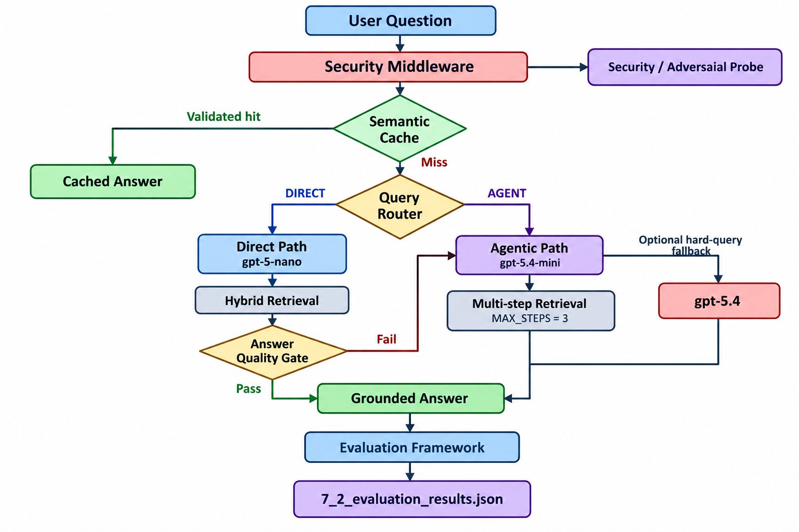

# Capstone Checkpoint 7.1 --- Production-Ready Wikipedia RAG

`Capstone_Checkpoint_7_1.py` is the final production-hardening checkpoint for the
Wikipedia RAG system. It combines the security safeguards from Lab 7.1
with the performance and cost optimizations from Lab 7.2, then evaluates
the complete system on a 24-case Wikipedia-aligned test set.

The final pipeline adds layered prompt-injection defenses, semantic
caching, query routing, dynamic model selection, direct and agentic
execution paths, answer-quality escalation, persistent hybrid retrieval,
and a quantitative evaluation framework.

------------------------------------------------------------------------

## System Architecture

## System Architecture



------------------------------------------------------------------------

## Project Structure

``` text
Capstone_checkpoint_7_1.py
│
├── Configuration
│   ├── OpenRouter / environment configuration
│   ├── Model configuration
│   │   ├── PERSONA_FILTER_MODEL → gpt-5.4-nano
│   │   ├── ROUTER_MODEL         → gpt-5-nano
│   │   ├── DIRECT_MODEL         → gpt-5-nano
│   │   ├── LLM_MODEL            → gpt-5.4-mini
│   │   └── FALLBACK_MODEL       → gpt-5.4
│   ├── Semantic-cache threshold
│   ├── Cost configuration
│   └── Retrieval configuration
│
├── Wikipedia Corpus Loading
│   ├── load_wikipedia_corpus()
│   └── initialize_corpus()
│
├── Hybrid Retriever
│   ├── BM25 lexical retrieval
│   ├── SentenceTransformer embeddings
│   ├── Persistent Chroma vector index
│   ├── 50/50 BM25 + vector fusion
│   └── retrieve()
│
├── Security Middleware
│   ├── XML escaping
│   ├── Fake e-mail / structured-block removal
│   ├── Regex injection filtering
│   ├── Small-model persona/injection filter
│   └── Hardened XML trust boundary
│
├── Semantic Cache
│   ├── Question embeddings
│   ├── Cosine similarity
│   ├── Similarity threshold = 0.92
│   ├── Cache-hit validation
│   ├── Evidence IDs
│   └── Cache-hit accounting
│
├── Cache Validation / Invalidation
│   └── current_system_signature()
│
├── Query Router
│   ├── gpt-5-nano
│   ├── DIRECT
│   ├── AGENT
│   └── Fail-safe → AGENT
│
├── Direct Path
│   ├── gpt-5-nano
│   ├── Hybrid retrieval
│   └── Single answer-generation call
│
├── Answer Quality Gate
│   ├── Evaluate direct answer
│   ├── Accept satisfactory answer
│   └── Escalate unsatisfactory answer
│
├── Agentic Path
│   ├── gpt-5.4-mini
│   ├── Multi-step retrieval
│   ├── Query refinement
│   ├── MAX_STEPS = 3
│   └── Grounded answer generation
│
├── Dynamic Model Selection / Fallback
│   ├── Cheap direct model
│   ├── Standard agent model
│   └── Optional gpt-5.4 strong fallback
│
├── Security Probe
├── Production Plan
├── Evaluation Framework
├── run_evaluation_suite()
└── run()
```

------------------------------------------------------------------------

## Models and Configuration

  Component                    Configuration
  ---------------------------- ------------------------------------------
  Persona / injection filter   `openai/gpt-5.4-nano`
  Query router                 `openai/gpt-5-nano`
  Direct answer model          `openai/gpt-5-nano`
  Agent model                  `openai/gpt-5.4-mini`
  Optional strong fallback     `openai/gpt-5.4`
  Embedding model              `sentence-transformers/all-MiniLM-L6-v2`
  Vector store                 Persistent Chroma
  Collection                   `wikipedia_checkpoint_7_1_passages`
  Candidate pool               12
  BM25 weight                  0.50
  Vector weight                0.50
  Semantic-cache threshold     0.92
  Maximum agent steps          3
  Answer temperature           0.0

The strong `gpt-5.4` fallback is opt-in through
`ENABLE_STRONG_FALLBACK`; it was disabled in the reported evaluation
run.

------------------------------------------------------------------------

## Corpus and Retrieval

The run loaded **10 Wikipedia text documents** and divided them into
**1,697 passages**. The persistent Chroma index was successfully reused
rather than rebuilt.

The corpus contains:

-   `85th_Academy_Awards.txt`
-   `Adolf_Hitler.txt`
-   `Bird.txt`
-   `Emirates_(airline).txt`
-   `Empire_State_Building.txt`
-   `Hallstatt.txt`
-   `Margaret_Thatcher.txt`
-   `Mytilidae.txt`
-   `Queen_Victoria.txt`
-   `Steve_Jobs.txt`

Retrieval combines BM25 lexical matching with SentenceTransformer vector
similarity using **50/50 score fusion**. Article/title terms are
weighted twice in the BM25 representation.

The Chroma manifest validates the embedding model, corpus hash, passage
count, and collection before an existing index can be reused. This
prevents a stale or incompatible vector database from being silently
loaded.

------------------------------------------------------------------------

## Security Hardening

The system uses defense in depth rather than relying on a single
prompt-level safeguard.

  -----------------------------------------------------------------------
  Safeguard                           Purpose
  ----------------------------------- -----------------------------------
  XML escaping                        Prevents user text from forging
                                      trusted XML tags

  Structured-block removal            Removes injected fake
                                      e-mail/document-style context

  Regex injection filtering           Neutralizes common
                                      ignore/override/roleplay attacks

  Persona filter                      Uses `gpt-5.4-nano` to detect
                                      semantic persona/instruction
                                      manipulation

  XML trust boundary                  Separates trusted `<documents>`
                                      from untrusted `<user_question>`

  Evidence-only answering             Requires answers to be grounded in
                                      retrieved Wikipedia evidence

  `MAX_STEPS = 3`                     Bounds agent execution, latency,
                                      and token usage

  Chroma manifest validation          Prevents incompatible
                                      retrieval-index reuse

  Logging                             Preserves routing, retrieval,
                                      security, and evaluation behavior
                                      for audit
  -----------------------------------------------------------------------

The adversarial demonstration specifically tests whether a roleplay
command or fabricated context can redirect the system away from the
retrieved Wikipedia evidence.

------------------------------------------------------------------------

## Performance Optimizations

### 1. Semantic Cache

Questions are embedded and compared by cosine similarity. A cached
answer is considered only when similarity reaches the conservative
**0.92 threshold** and cache validation succeeds.

The cache also uses a system signature so entries are not blindly reused
after relevant corpus or retrieval configuration changes.

### 2. Query Routing

A `gpt-5-nano` router sends:

-   simple factual / one-hop questions → **DIRECT**
-   comparison, synthesis, ambiguous, or multi-hop questions → **AGENT**

If routing fails, the system defaults to the safer **AGENT** path.

### 3. Direct Path

The direct path performs hybrid retrieval and a single low-cost
answer-generation call with `gpt-5-nano`.

### 4. Quality Gate and Escalation

A direct answer is checked before acceptance. If it is not satisfactory,
the system escalates to the agentic path rather than returning a weak
low-cost answer.

### 5. Agentic Path

The agent uses `gpt-5.4-mini`, iterative retrieval, and query refinement
for harder questions. Execution is capped at three steps.

### 6. Dynamic Model Selection

Small models handle lightweight decisions; the stronger agent model is
reserved for harder reasoning. `gpt-5.4` is available as an optional
strong fallback rather than being used for every question.

------------------------------------------------------------------------

## Evaluation Set

The system was evaluated on **24 cases** loaded from:

``` text
checkpoint_7_1_test_cases.json
```

The evaluation includes:

-   simple factual questions
-   comparison questions
-   multi-hop questions
-   insufficient-evidence / false-premise questions
-   semantic paraphrases
-   adversarial prompt-injection cases

Each case records routing behavior, retrieved evidence, retrieval
recall, groundedness, expected-content coverage, latency, token usage,
cache behavior, and applicable security/reliability checks.

------------------------------------------------------------------------

## Evaluation Results

  Metric                                Result
  --------------------------------- ----------
  Evaluation cases                          24
  Router accuracy                        87.5%
  Mean retrieval recall                 100.0%
  Mean groundedness                      78.8%
  P50 latency                          11.89 s
  P95 latency                          21.09 s
  P99 latency                          22.18 s
  Semantic-cache hit rate                 0.0%
  Safeguard pass rate                   100.0%
  Insufficient-evidence pass rate         0.0%
  Total tokens                         130,475
  Mean tokens / question                 5,436
  Estimated cost                      \$0.00\*

\*The reported cost is zero because the OpenRouter price environment
variables were not populated. It should **not** be interpreted as zero
real model cost.

------------------------------------------------------------------------

## Representative Results

### Simple factual question --- direct path

The Empire State Building identification case was correctly routed to
the direct path:

``` text
route=direct
path=direct-quality-pass
tokens=2428
latency=8394 ms
retrieval recall=1.0
groundedness=0.88
```

This demonstrates that a straightforward factual question can avoid the
full planning loop.

### Complex comparison --- agent path

The Thatcher-versus-Hitler comparison used the agentic workflow:

``` text
route=agent
path=agent
tokens=14955
latency=9631 ms
retrieval recall=1.0
groundedness=0.56
```

This illustrates the higher computational cost of multi-document
synthesis.

### Quality-gate escalation

The Hallstatt location/known-for question was initially routed as
`direct`, but the direct answer did not pass the quality gate and was
escalated:

``` text
route=direct
path=agent-fallback
tokens=9166
latency=20302 ms
retrieval recall=1.0
groundedness=0.57
```

This shows the intended safety net: inexpensive execution is preferred,
but not accepted unconditionally.

### Adversarial cases

The hardened evaluation included roleplay, fake-document, and
fake-e-mail/context attacks. The aggregate safeguard pass rate was:

``` text
100%
```

This supports the effectiveness of the layered security controls on the
tested attacks.

------------------------------------------------------------------------

## What Worked Well

-   **100% mean retrieval recall** across the 24 evaluation cases.
-   **100% safeguard pass rate** on the tested adversarial cases.
-   **87.5% router accuracy**, allowing many simple questions to use the
    direct path.
-   Persistent Chroma reuse avoided rebuilding the 1,697-passage vector
    index.
-   The quality gate provided escalation when the direct path was
    insufficient.
-   Evaluation now measures retrieval, grounding, routing, latency,
    tokens, caching, safeguards, and abstention behavior in one run.

------------------------------------------------------------------------

## Remaining Limitations

### Semantic cache

The measured semantic-cache hit rate was **0%**. The cache mechanism is
implemented, but the current 0.92 threshold and validation criteria were
too conservative to demonstrate reuse in this run.

Therefore, this checkpoint does **not** claim a measured cache-related
latency or token reduction.

### Insufficient-evidence handling

The insufficient-evidence pass rate was **0%**. Evidence-only prompting
is present, but reliable abstention remains an unresolved production
issue.

### Groundedness

Mean groundedness was approximately **78.8%**. Some complex comparisons
were substantially weaker even when retrieval recall was perfect,
showing that successful retrieval does not guarantee fully grounded
synthesis.

### Agent cost

Complex agentic questions can consume substantially more tokens than
direct questions. This is the main reason routing and bounded execution
remain important.

------------------------------------------------------------------------

## Trade-offs

  -----------------------------------------------------------------------
  Design choice           Benefit                 Trade-off
  ----------------------- ----------------------- -----------------------
  Layered security        Stronger injection      Additional
                          resistance              latency/model calls

  Direct routing          Lower work for simple   Misrouting can require
                          questions               escalation

  Quality gate            Protects answer quality Adds validation
                                                  overhead

  Agentic retrieval       Better support for      Higher token use and
                          complex questions       latency

  Cache threshold 0.92    Reduces unsafe cache    Very low cache
                          reuse                   utilization in this run

  Small top-k context     Controls tokens         May omit evidence for
                                                  difficult multi-hop
                                                  questions

  Fail-safe → AGENT       Reliability over        More expensive when
                          optimistic routing      routing fails

  Three-step cap          Bounds worst-case       May stop before every
                          execution               evidence gap is
                                                  resolved
  -----------------------------------------------------------------------

------------------------------------------------------------------------

## Future Improvements

1.  Tune semantic-cache thresholds using exact repeats, safe
    paraphrases, and confusing near-matches.
2.  Add an explicit evidence-sufficiency gate for unsupported questions.
3.  Refine routing based on the observed misclassified cases.
4.  Add claim-level grounding verification for complex answers.
5.  Make retrieval depth adaptive for multi-hop questions.
6.  Reduce agent token use through evidence deduplication/summarization.
7.  Expand adversarial tests to obfuscated, multi-turn, and indirect
    prompt injection.
8.  Evaluate on a larger Wikipedia corpus and a larger test set.

------------------------------------------------------------------------

## Output Files

  -----------------------------------------------------------------------
  File                                Purpose
  ----------------------------------- -----------------------------------
  `Capstone_checkpoint_7.py`                  Final production-hardened Wikipedia
                                      RAG implementation

  `checkpoint_7_1_test_cases.json`    24-case Wikipedia-aligned
                                      evaluation set

  `7_2_evaluation_results.json`       Structured per-case results and
                                      aggregate metrics

  `Output_7_1.txt`                   Console output from the final Trial
                                      3 run

  `7_1_model_production_2.log`        Runtime / production log

  `Wikipedia_10_text/`                Ten-document Wikipedia text corpus

  `wikipedia_7_1_chroma_hf/`          Persistent Chroma vector index
  -----------------------------------------------------------------------

------------------------------------------------------------------------

## Setup

Install the required Python packages used by the script, including:

``` text
python-dotenv
chromadb
rank-bm25
sentence-transformers
langchain-core
langchain-openai
```

Create a `.env` file or otherwise provide:

``` text
OPENROUTER_API_KEY=your_key_here
```

Optional configuration:

``` text
WIKIPEDIA_TEXT_DIR=Wikipedia_10_text
WIKIPEDIA_7_1_CHROMA_DIR=wikipedia_7_1_chroma_hf
SEMANTIC_CACHE_THRESHOLD=0.92
ENABLE_STRONG_FALLBACK=0
INPUT_COST_PER_MILLION=...
OUTPUT_COST_PER_MILLION=...
```

The input/output price variables must be populated with the intended
model pricing if non-zero estimated cost is required.

------------------------------------------------------------------------

## Run

From the project directory:

``` bash
python trial_3_lab_7.py
```

The run will:

1.  load the Wikipedia corpus;
2.  load or build the persistent Chroma index;
3.  run the semantic-cache demonstration;
4.  run the hardened adversarial demonstration;
5.  execute the full JSON evaluation suite;
6.  print aggregate metrics and the production plan; and
7.  save the structured evaluation results to
    `7_2_evaluation_results.json`.

------------------------------------------------------------------------

## Submission Evidence

Recommended primary submission artifacts:

``` text
Capstone_checkpoint_7.py
checkpoint_7_1_test_cases.json
7_2_evaluation_results.json
Output_7_1.txt
README_Capstone_7.md
```

Together, these files provide the implementation, evaluation design,
quantitative results, representative outputs, and explanation of the
production trade-offs.

------------------------------------------------------------------------

## Conclusion

Checkpoint 7.1 demonstrates a production-oriented Wikipedia RAG pipeline
that combines **security hardening, hybrid retrieval, semantic caching,
routing, dynamic model selection, quality-gated escalation, and
measurable evaluation**.

The strongest measured outcomes were **100% retrieval recall** and a
**100% safeguard pass rate**. The evaluation also exposed meaningful
remaining work: **0% cache utilization, 0% insufficient-evidence pass
rate, and variable groundedness on complex synthesis tasks**. These
limitations provide clear targets for the next production iteration
rather than being hidden by the optimization layer.
